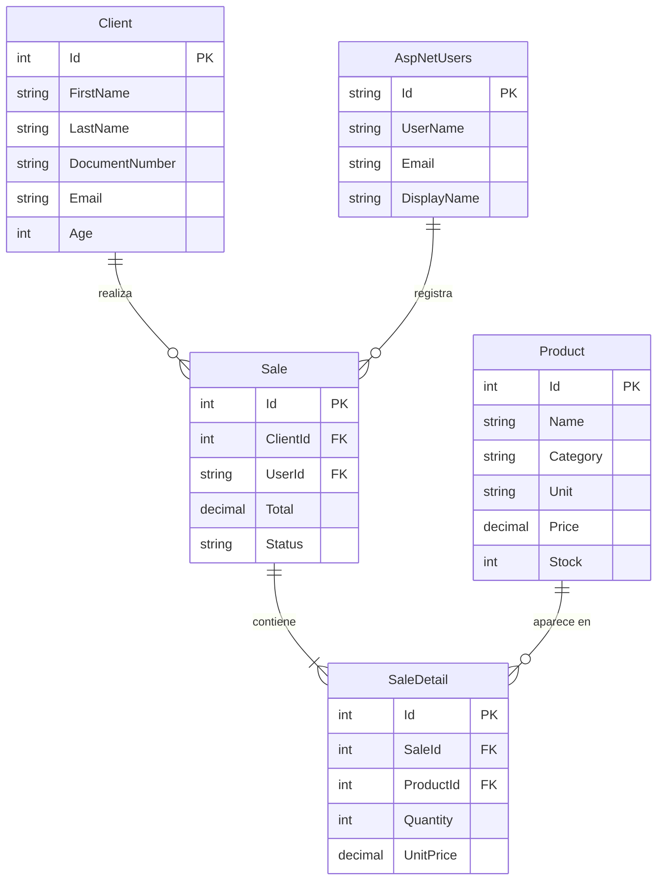

# Firmeza — Panel Administrativo de Materiales de Construcción

Sistema web administrativo desarrollado con **ASP.NET Core 10 Razor Pages** para gestionar productos, clientes y ventas de una distribuidora de materiales de construcción.

---

## Tecnologías utilizadas

| Capa | Tecnología |
|---|---|
| Framework web | ASP.NET Core 10 Razor Pages |
| Base de datos | PostgreSQL 16 |
| ORM | Entity Framework Core 10 + Npgsql |
| Autenticación | ASP.NET Core Identity |
| Estilos | Tailwind CSS (CDN) + Bootstrap Icons |
| Pruebas | xUnit |
| Contenedores | Docker + docker-compose |
| Exportación (preparado) | EPPlus (Excel) + QuestPDF (PDF) |

---

## Arquitectura del proyecto

El proyecto sigue una arquitectura de **3 capas** (Clean Architecture simplificada):

```
Firmeza/
│
├── src/
│   ├── Firmeza.Core/               ← Capa de dominio
│   │   ├── Entities/               ← Entidades del negocio (Product, Client, Sale, SaleDetail)
│   │   ├── Interfaces/             ← Contratos de acceso a datos
│   │   └── Enums/                  ← Constantes de roles (Admin, Customer)
│   │
│   ├── Firmeza.Infrastructure/     ← Capa de infraestructura
│   │   ├── Data/                   ← ApplicationDbContext (EF Core)
│   │   ├── Identity/               ← ApplicationUser (extiende IdentityUser)
│   │   └── Migrations/             ← Migraciones generadas automáticamente por EF
│   │
│   └── Firmeza.Web/                ← Capa de presentación
│       ├── Pages/                  ← Páginas Razor (Auth, Dashboard, Products, Clients, Sales)
│       ├── ViewModels/             ← DTOs con validaciones para las vistas
│       ├── wwwroot/                ← Archivos estáticos (CSS, JS, librerías)
│       ├── Program.cs              ← Punto de entrada y configuración de servicios
│       ├── appsettings.json        ← Configuración de conexión y logging
│       └── Dockerfile              ← Imagen Docker del proyecto web
│
└── tests/
    └── Firmeza.Tests/              ← Pruebas unitarias con xUnit
        ├── Core/                   ← Pruebas de entidades del dominio
        └── Web/                    ← Pruebas de lógica de presentación
```

### ¿Por qué esta separación?
- **Core** no depende de nada externo — puro C#. Si cambias la BD o el framework, Core no cambia.
- **Infrastructure** se encarga de todo lo que toca el exterior (BD, archivos, APIs externas).
- **Web** solo muestra datos y recibe órdenes del usuario.

---

## Modelo de datos



---

## Sistema de roles

| Rol | Acceso |
|---|---|
| `Admin` | Acceso completo al panel Razor (dashboard, productos, clientes, ventas) |
| `Customer` | Solo puede registrarse. **No puede acceder al panel Razor.** |

Al registrarse un usuario público, automáticamente queda con rol `Customer`.
Los admins se crean via seed al arrancar la aplicación.

### Usuario administrador por defecto
```
Email:    admin@firmeza.com
Contraseña: Admin123!
```
> Este usuario se crea automáticamente la primera vez que la app arranca.

---

## Instalación y ejecución local

### Requisitos previos
- [.NET 10 SDK](https://dotnet.microsoft.com/download)
- PostgreSQL 14+ **o** Docker Desktop

### Opción A — PostgreSQL local

1. Clona el repositorio
2. Edita la cadena de conexión en `src/Firmeza.Web/appsettings.json`:
   ```json
   "DefaultConnection": "Host=localhost;Port=5432;Database=firmeza_db;Username=postgres;Password=TU_PASSWORD"
   ```
3. Crea la migración inicial:
   ```bash
   dotnet ef migrations add Initial \
     --project src/Firmeza.Infrastructure \
     --startup-project src/Firmeza.Web
   ```
4. Ejecuta la aplicación (aplica la migración y crea el admin automáticamente):
   ```bash
   dotnet run --project src/Firmeza.Web
   ```
5. Abre `http://localhost:5068` en el navegador.

### Opción B — PostgreSQL vía Docker (más rápido)

```bash
# Levanta solo el contenedor de la base de datos
docker run -d \
  --name firmeza_postgres \
  -e POSTGRES_PASSWORD=admin123 \
  -e POSTGRES_DB=firmeza_db \
  -e POSTGRES_USER=postgres \
  -p 5432:5432 \
  postgres:16
```

Luego sigue desde el paso 2 de la Opción A usando `Password=admin123`.

### Opción C — Todo en Docker (app + BD)

```bash
# Edita YOUR_PASSWORD en docker-compose.yml primero
docker-compose up --build
```

Accede en `http://localhost:8080`

---

## Ejecutar las pruebas

```bash
dotnet test tests/Firmeza.Tests
```

Resultado esperado: **11 pruebas pasando, 0 fallando**.

---

## Funcionalidades implementadas

### Autenticación (Task 4)
- Login con validación de rol — si un `Customer` intenta entrar al panel, se le bloquea.
- Registro público de clientes — cualquier persona puede crear una cuenta como `Customer`.
- Logout desde el sidebar.
- Página de acceso denegado (403).

### Dashboard (Task 5)
- Total de productos, clientes, ventas e ingresos.
- Tabla de últimas 5 ventas con estado (Pending / Completed / Cancelled).
- Alerta de productos con stock menor a 10 unidades.

### Gestión de Productos (Task 6)
- CRUD completo: crear, listar, editar, eliminar.
- Búsqueda por nombre.
- Filtrado por categoría (Cemento, Varilla, Pintura, etc.).
- Indicador visual de stock bajo.

### Manejo de errores — Edad (Task 7)
- El campo `Age` del cliente se recibe como texto (`AgeInput`).
- Se convierte con `int.Parse()` dentro de un `try-catch`.
- Si el usuario escribe letras, se muestra un mensaje claro: *"Age must be a whole number"*.

### Gestión de Clientes (Task 8)
- CRUD completo con validaciones de email, teléfono y documento.
- Búsqueda combinada por nombre completo o número de documento.

### Ventas (Task 5)
- Lista de ventas con filtro por estado y búsqueda por cliente.

---

## Documentación técnica

Los diagramas técnicos se encuentran en `docs/diagrams/`:

- [`er-diagram.md`](docs/diagrams/er-diagram.md) — Diagrama Entidad-Relación
- [`class-diagram.md`](docs/diagrams/class-diagram.md) — Diagrama de clases

---

## Notas de despliegue

- El `Dockerfile` usa compilación en dos etapas (multi-stage build): SDK para compilar, runtime para ejecutar. La imagen final es más liviana.
- Las variables sensibles (contraseña de BD) deben pasarse como variables de entorno en producción, no en `appsettings.json`.
- Las migraciones se aplican automáticamente al arrancar (`database.MigrateAsync()` en `Program.cs`).

---

## Autor

Proyecto desarrollado como taller académico M6.3S1 — Administración de Sistemas Web con ASP.NET Core.
