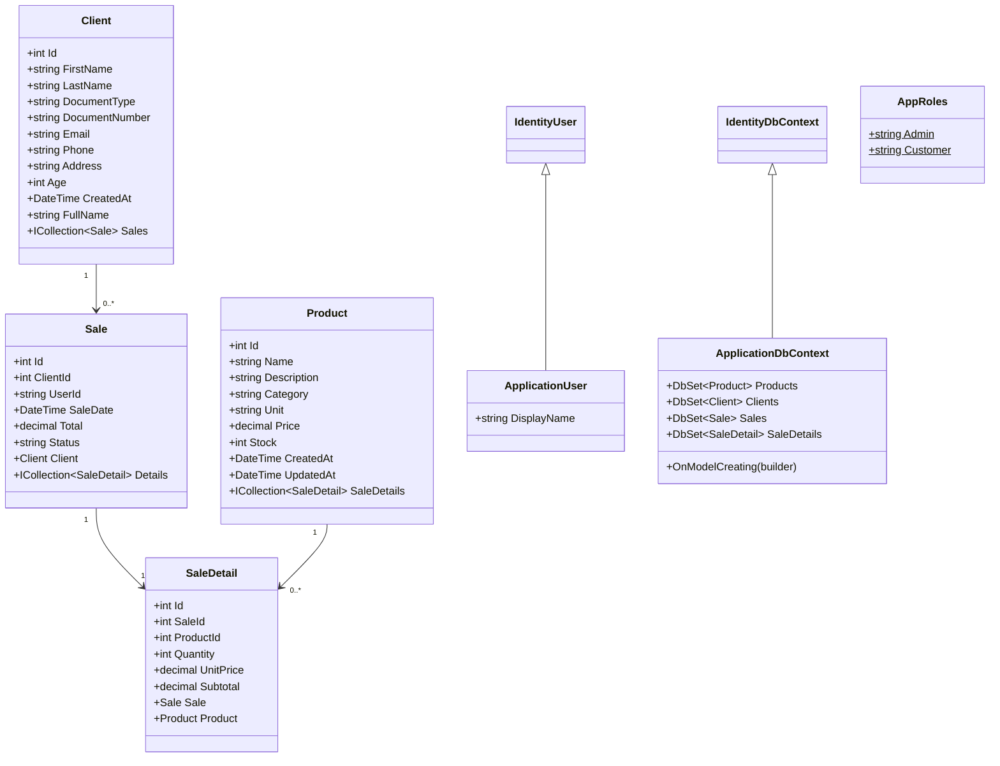

# Class Diagram

```mermaid
classDiagram

    class Product {
        +int Id
        +string Name
        +string Description
        +string Category
        +string Unit
        +decimal Price
        +int Stock
        +DateTime CreatedAt
        +DateTime UpdatedAt
        +ICollection~SaleDetail~ SaleDetails
    }

    class Client {
        +int Id
        +string FirstName
        +string LastName
        +string DocumentType
        +string DocumentNumber
        +string Email
        +string Phone
        +string Address
        +int Age
        +DateTime CreatedAt
        +string FullName
        +ICollection~Sale~ Sales
    }

    class Sale {
        +int Id
        +int ClientId
        +string UserId
        +DateTime SaleDate
        +decimal Total
        +string Status
        +Client Client
        +ICollection~SaleDetail~ Details
    }

    class SaleDetail {
        +int Id
        +int SaleId
        +int ProductId
        +int Quantity
        +decimal UnitPrice
        +decimal Subtotal
        +Sale Sale
        +Product Product
    }

    class ApplicationUser {
        +string DisplayName
    }
    IdentityUser <|-- ApplicationUser

    class ApplicationDbContext {
        +DbSet~Product~ Products
        +DbSet~Client~ Clients
        +DbSet~Sale~ Sales
        +DbSet~SaleDetail~ SaleDetails
        +OnModelCreating(builder)
    }
    IdentityDbContext <|-- ApplicationDbContext

    class AppRoles {
        +string Admin$
        +string Customer$
    }

    Client "1" --> "0..*" Sale
    Sale "1" --> "1..*" SaleDetail
    Product "1" --> "0..*" SaleDetail
```
