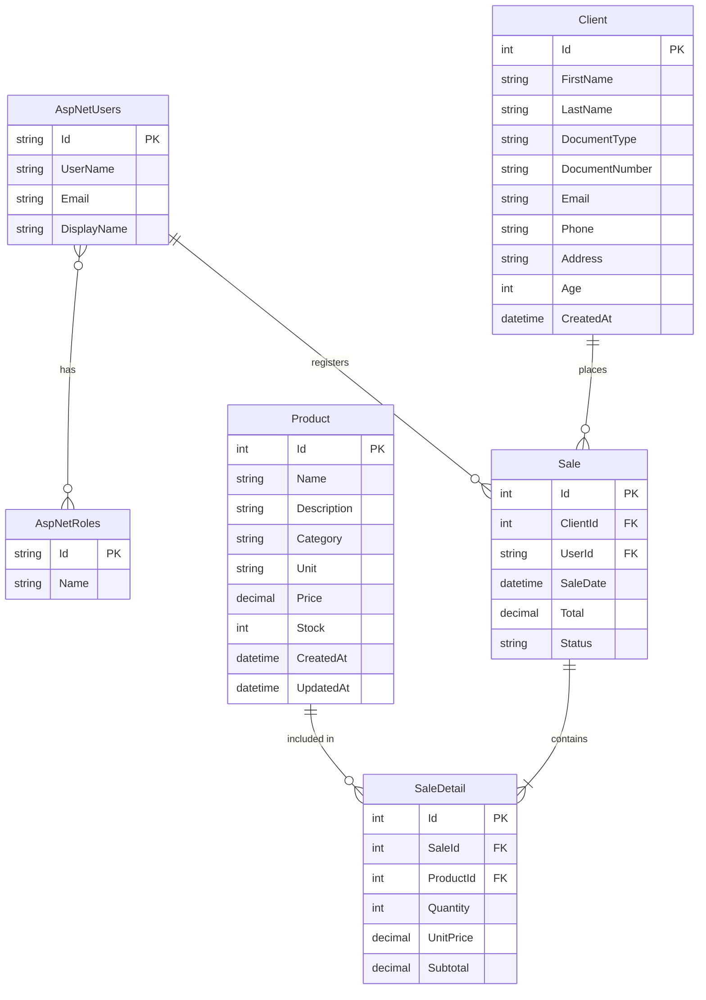

# Entity-Relationship Diagram

```mermaid
erDiagram
    AspNetUsers {
        string Id PK
        string UserName
        string Email
        string DisplayName
    }

    AspNetRoles {
        string Id PK
        string Name
    }

    Product {
        int Id PK
        string Name
        string Description
        string Category
        string Unit
        decimal Price
        int Stock
        datetime CreatedAt
        datetime UpdatedAt
    }

    Client {
        int Id PK
        string FirstName
        string LastName
        string DocumentType
        string DocumentNumber
        string Email
        string Phone
        string Address
        int Age
        datetime CreatedAt
    }

    Sale {
        int Id PK
        int ClientId FK
        string UserId FK
        datetime SaleDate
        decimal Total
        string Status
    }

    SaleDetail {
        int Id PK
        int SaleId FK
        int ProductId FK
        int Quantity
        decimal UnitPrice
        decimal Subtotal
    }

    Client ||--o{ Sale : "places"
    AspNetUsers ||--o{ Sale : "registers"
    Sale ||--|{ SaleDetail : "contains"
    Product ||--o{ SaleDetail : "included in"
    AspNetUsers }o--o{ AspNetRoles : "has"
```
